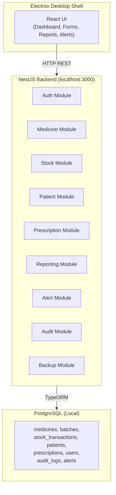
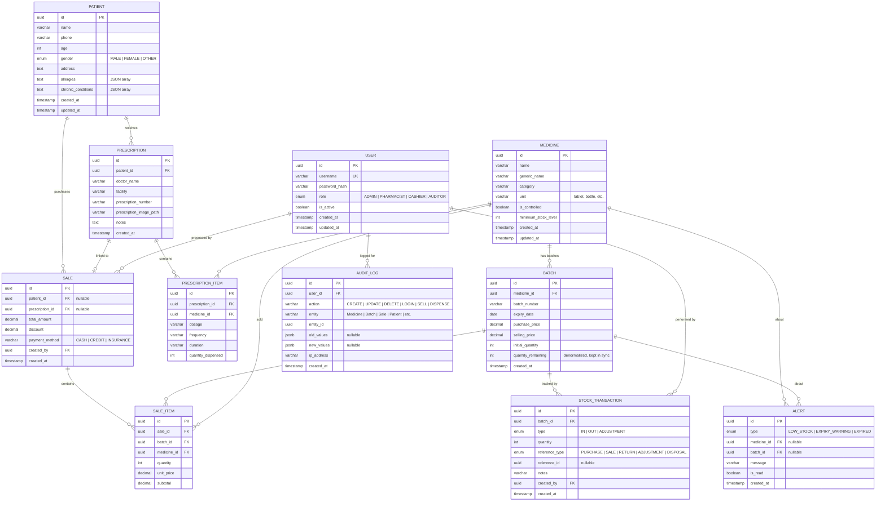
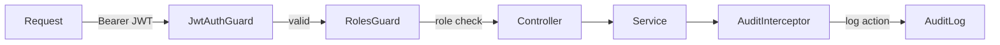

# Pharmacy Management System – Implementation Plan

> **Stack:** NestJS (Backend) + PostgreSQL (Database) + Electron + React (Desktop UI)
> **Architecture:** Modular, Local-First Pharmacy ERP – fully offline, no internet required

---

## 1. High-Level Architecture



### How It Works
- **Electron** bundles the React frontend and spawns a local NestJS server on startup.
- **NestJS** handles all business logic, validation, RBAC, and report generation.
- **PostgreSQL** runs locally — no cloud dependency. Backup via `pg_dump`.

---

## 2. Project Directory Structure

```
Pharmacy_system/
├── backend/                          # NestJS API
│   ├── src/
│   │   ├── app.module.ts
│   │   ├── main.ts
│   │   ├── config/                   # DB config, app config
│   │   │   └── database.config.ts
│   │   ├── common/                   # Shared utilities
│   │   │   ├── decorators/           # @Roles(), @CurrentUser()
│   │   │   ├── guards/              # JwtAuthGuard, RolesGuard
│   │   │   ├── interceptors/        # AuditInterceptor
│   │   │   ├── filters/             # HttpExceptionFilter
│   │   │   ├── pipes/               # ValidationPipe config
│   │   │   └── enums/               # UserRole, TransactionType, etc.
│   │   ├── modules/
│   │   │   ├── auth/                # Login, JWT, password hashing
│   │   │   │   ├── auth.module.ts
│   │   │   │   ├── auth.controller.ts
│   │   │   │   ├── auth.service.ts
│   │   │   │   ├── strategies/      # JwtStrategy, LocalStrategy
│   │   │   │   └── dto/
│   │   │   ├── users/               # User CRUD, role management
│   │   │   │   ├── users.module.ts
│   │   │   │   ├── users.controller.ts
│   │   │   │   ├── users.service.ts
│   │   │   │   ├── entities/        # user.entity.ts
│   │   │   │   └── dto/
│   │   │   ├── medicines/           # Medicine master data
│   │   │   │   ├── medicines.module.ts
│   │   │   │   ├── medicines.controller.ts
│   │   │   │   ├── medicines.service.ts
│   │   │   │   ├── entities/        # medicine.entity.ts
│   │   │   │   └── dto/
│   │   │   ├── batches/             # Batch tracking (expiry per batch)
│   │   │   │   ├── batches.module.ts
│   │   │   │   ├── batches.controller.ts
│   │   │   │   ├── batches.service.ts
│   │   │   │   ├── entities/        # batch.entity.ts
│   │   │   │   └── dto/
│   │   │   ├── stock/               # Stock transactions (FIFO, ledger)
│   │   │   │   ├── stock.module.ts
│   │   │   │   ├── stock.controller.ts
│   │   │   │   ├── stock.service.ts
│   │   │   │   ├── entities/        # stock-transaction.entity.ts
│   │   │   │   └── dto/
│   │   │   ├── patients/            # Patient records & medical info
│   │   │   │   ├── patients.module.ts
│   │   │   │   ├── patients.controller.ts
│   │   │   │   ├── patients.service.ts
│   │   │   │   ├── entities/        # patient.entity.ts
│   │   │   │   └── dto/
│   │   │   ├── prescriptions/       # Prescriptions + items
│   │   │   │   ├── prescriptions.module.ts
│   │   │   │   ├── prescriptions.controller.ts
│   │   │   │   ├── prescriptions.service.ts
│   │   │   │   ├── entities/        # prescription.entity.ts, prescription-item.entity.ts
│   │   │   │   └── dto/
│   │   │   ├── alerts/              # Low-stock & expiry alerts
│   │   │   │   ├── alerts.module.ts
│   │   │   │   ├── alerts.controller.ts
│   │   │   │   ├── alerts.service.ts
│   │   │   │   ├── entities/        # alert.entity.ts
│   │   │   │   └── dto/
│   │   │   ├── audit/               # Audit log (interceptor-driven)
│   │   │   │   ├── audit.module.ts
│   │   │   │   ├── audit.service.ts
│   │   │   │   ├── audit.controller.ts
│   │   │   │   └── entities/        # audit-log.entity.ts
│   │   │   ├── reports/             # PDF/Excel report generation
│   │   │   │   ├── reports.module.ts
│   │   │   │   ├── reports.controller.ts
│   │   │   │   └── reports.service.ts
│   │   │   └── backup/              # pg_dump scheduling & restore
│   │   │       ├── backup.module.ts
│   │   │       ├── backup.controller.ts
│   │   │       └── backup.service.ts
│   │   └── database/
│   │       └── migrations/          # TypeORM migrations
│   ├── test/                        # e2e tests
│   ├── package.json
│   ├── tsconfig.json
│   └── .env.example
├── frontend/                         # React + Electron
│   ├── public/
│   ├── src/
│   │   ├── main/                    # Electron main process
│   │   │   ├── main.ts              # Electron entry, spawn NestJS
│   │   │   └── preload.ts
│   │   ├── renderer/                # React app
│   │   │   ├── App.tsx
│   │   │   ├── index.tsx
│   │   │   ├── api/                 # Axios API layer
│   │   │   │   └── client.ts
│   │   │   ├── components/          # Shared UI components
│   │   │   ├── pages/               # Route-level pages
│   │   │   │   ├── Dashboard/
│   │   │   │   ├── Inventory/
│   │   │   │   ├── Sales/
│   │   │   │   ├── Patients/
│   │   │   │   ├── Prescriptions/
│   │   │   │   ├── Reports/
│   │   │   │   ├── Settings/
│   │   │   │   └── Login/
│   │   │   ├── hooks/               # Custom React hooks
│   │   │   ├── context/             # Auth context, theme context
│   │   │   ├── utils/
│   │   │   └── styles/
│   │   └── shared/                  # Shared types between main & renderer
│   ├── electron-builder.yml
│   ├── package.json
│   ├── tsconfig.json
│   └── vite.config.ts
└── README.md
```

---

## 3. Database Schema Design

> **Core principle:** Stock is NEVER updated directly. Current quantity is always **computed from `stock_transactions`**. Expiry dates are tracked **per batch**, not per medicine.

### Entity-Relationship Diagram



### Key Design Decisions

| Decision | Rationale |
|---|---|
| `quantity_remaining` on Batch is **denormalized** | Kept in sync via transactions for fast reads, but truth comes from `SUM(stock_transactions)` |
| `allergies` / `chronic_conditions` as JSON arrays | Flexible, no need for separate join tables for initial version |
| `Sale` and `SaleItem` separate from `StockTransaction` | Sales are a business event; stock transactions are the ledger — keeps separation of concerns |
| UUIDs everywhere | Safer for local-first sync scenarios; no autoincrement conflicts if multi-branch later |
| `old_values` / `new_values` as JSONB on AuditLog | Full change tracking without schema bloat |

---

## 4. Implementation Phases

### Phase 1: Project Foundation

#### [NEW] Backend Project Setup

- Initialize NestJS project: `npx -y @nestjs/cli new backend --package-manager npm --skip-git`
- Install core dependencies: `@nestjs/typeorm`, `typeorm`, `pg`, `@nestjs/jwt`, `@nestjs/passport`, `passport-jwt`, `passport-local`, `bcrypt`, `class-validator`, `class-transformer`, `@nestjs/schedule`, `@nestjs/config`
- Install reporting deps: `pdfkit`, `exceljs`
- Configure TypeORM with local PostgreSQL connection
- Create `.env.example` with database credentials
- Set up global validation pipe and exception filters

#### [NEW] Frontend Project Setup

- Initialize with Vite + React + TypeScript using `electron-vite`: `npx -y create-electron-vite@latest frontend -- --template react-ts`
- Install UI dependencies: `react-router-dom`, `axios`, `@tanstack/react-query`
- Configure Electron main process to spawn NestJS backend
- Set up project-level scripts in root `package.json`

#### [NEW] Database Migrations

- Create TypeORM migration for all initial entities listed in the schema above
- Seed default admin user (`admin / admin123` — hashed with bcrypt)

---

### Phase 2: Core Backend Modules

> Each module follows NestJS convention: `module.ts`, `controller.ts`, `service.ts`, `entities/`, `dto/`

#### Auth & Users Module
- `POST /auth/login` — validate credentials, return JWT
- `POST /auth/logout` — client-side token removal
- `GET /auth/profile` — return current user from JWT
- `CRUD /users` — admin-only user management
- **Guards:** `JwtAuthGuard` (global), `RolesGuard` (per-route)
- **Decorators:** `@Roles(UserRole.ADMIN)`, `@CurrentUser()`
- Passwords hashed with **bcrypt** (salt rounds: 10)

#### Medicine Module
- `CRUD /medicines` — name, generic name, category, unit, controlled flag, minimum stock
- `GET /medicines/:id/stock` — computed current stock across all batches
- Search and filter by name, category, controlled status

#### Batch Module
- `CRUD /batches` — linked to medicine, tracks expiry, purchase/selling price
- `GET /batches/expiring?days=30` — near-expiry batches
- `GET /batches/expired` — all expired batches
- Auto-blocks operations on expired batches

#### Stock Module
- `POST /stock/receive` — record incoming stock (creates IN transaction)
- `POST /stock/issue` — record outgoing stock with **FIFO logic**:
  1. Find non-expired batches for the medicine, sorted by `expiry_date ASC`
  2. Deduct from earliest-expiry batch first
  3. Create OUT transaction per batch touched
  4. Update `batch.quantity_remaining` (denormalized)
  5. Reject if total available < requested quantity
- `POST /stock/adjust` — manual adjustment with reason (admin only)
- `GET /stock/bin-card/:medicineId` — full transaction ledger (digital bin card)
- `GET /stock/stock-card/:medicineId` — summary with running balance (digital stock card)

#### Patient Module
- `CRUD /patients` — name, phone, age, gender, address, allergies, chronic conditions
- `GET /patients/:id/prescriptions` — prescription history
- `GET /patients/:id/sales` — purchase history
- Search by name or phone

#### Prescription Module
- `CRUD /prescriptions` — linked to patient, doctor info, image path
- `CRUD /prescriptions/:id/items` — medicines, dosage, frequency, duration
- `POST /prescriptions/:id/dispense` — creates a sale from prescription items using FIFO stock issue

#### Sale Module (within Stock module)
- `POST /sales` — create sale with items, auto-deduct stock via FIFO
- `GET /sales` — list with filters (date range, patient, staff)
- `GET /sales/:id` — sale detail with items

#### Alert Module
- Background job via `@nestjs/schedule` (CRON):
  - **Every day at 6:00 AM:** Check for medicines expiring within configurable days (default 90)
  - **Every day at 6:00 AM:** Check for medicines below minimum stock level
  - Insert `ALERT` records
- `GET /alerts` — unread alerts
- `PATCH /alerts/:id/read` — mark as read
- `GET /alerts/summary` — counts by type

#### Audit Module
- **AuditInterceptor** (NestJS interceptor) auto-logs CUD operations
- Stores: user, action, entity, entity_id, old/new values, timestamp
- `GET /audit` — admin/auditor only, filterable by entity, user, date range
- Controlled substance actions are always logged

#### Backup Module
- `POST /backup/now` — trigger immediate `pg_dump`
- `GET /backup/list` — list available backup files
- `POST /backup/restore` — restore from a selected backup file
- Scheduled job: daily at 10:00 PM via `@nestjs/schedule`
- Backup path configurable via `.env` (default: `D:/Backups/`)

#### Reports Module
- `GET /reports/sales?from=&to=` — sales summary
- `GET /reports/stock-movement?from=&to=` — stock in/out summary
- `GET /reports/expiry` — expiry report
- `GET /reports/controlled-substances` — controlled substance movement
- `GET /reports/user-activity?userId=&from=&to=` — user action log
- Each endpoint supports `?format=json|pdf|excel`
- PDF via **PDFKit**, Excel via **ExcelJS**

---

### Phase 3: React Frontend (Electron Renderer)

#### Pages & Layout

| Page | Description | Roles |
|---|---|---|
| **Login** | JWT authentication form | All |
| **Dashboard** | KPI cards, alerts summary, quick actions | All |
| **Inventory → Medicines** | Medicine list, add/edit, stock levels | Admin, Pharmacist |
| **Inventory → Batches** | Batch list per medicine, expiry highlighting | Admin, Pharmacist |
| **Inventory → Receive Stock** | Form to record incoming stock | Admin |
| **Inventory → Stock Issue** | FIFO-based dispensing form | Pharmacist, Cashier |
| **Inventory → Bin Card** | Transaction ledger per medicine | Admin, Pharmacist, Auditor |
| **Patients** | Patient list, add/edit, medical info | Pharmacist |
| **Prescriptions** | Prescription entry, link to patient & medicines | Pharmacist |
| **Sales** | Sales list, new sale, receipt | Cashier, Pharmacist |
| **Reports** | Report selection, date filters, PDF/Excel download | Admin, Auditor |
| **User Management** | User CRUD, role assignment | Admin |
| **Settings → Backup** | Backup now, restore, view backup history | Admin |

#### Frontend Architecture
- **State management:** React Context for auth + `@tanstack/react-query` for server state
- **Routing:** `react-router-dom` v6 with role-based route protection
- **API layer:** Centralized Axios instance hitting `http://localhost:3000/api`
- **Modern UI:** Clean, professional design with dark/light mode

---

### Phase 4: Electron Shell

- **Main process** (`main.ts`):
  - Spawns NestJS backend as a child process on app start
  - Waits for backend to be healthy before loading the React UI
  - Gracefully kills backend on app quit
- **Preload script**: Exposes safe IPC bridge for notifications, file dialogs
- **Build:** `electron-builder` for Windows installer (`.exe` / `.msi`)
- **Auto-start:** Configurable option to launch on system boot

---

### Phase 5: Backup & Data Safety

| Feature | Implementation |
|---|---|
| Automatic daily backup | `@nestjs/schedule` CRON → `pg_dump` at 10 PM |
| Manual backup | `POST /backup/now` → triggered from UI |
| Backup listing | Read backup directory, return file list |
| Restore | `psql < backup_file.sql` — admin only, with confirmation |
| Backup location | Configurable via `.env`, default `D:/Backups/` |
| Cloud backup (future) | Placeholder module for upload to Google Drive/S3 |

---

## 5. Security Model



### Role Permissions Matrix

| Action | Admin | Pharmacist | Cashier | Auditor |
|---|:---:|:---:|:---:|:---:|
| Manage users | ✅ | ❌ | ❌ | ❌ |
| Manage medicines | ✅ | ✅ | ❌ | ❌ |
| Receive stock | ✅ | ❌ | ❌ | ❌ |
| Issue/sell stock | ✅ | ✅ | ✅ | ❌ |
| Manage patients | ✅ | ✅ | ❌ | ❌ |
| Create prescriptions | ✅ | ✅ | ❌ | ❌ |
| View reports | ✅ | ❌ | ❌ | ✅ |
| View audit logs | ✅ | ❌ | ❌ | ✅ |
| Backup / restore | ✅ | ❌ | ❌ | ❌ |
| Adjust stock | ✅ | ❌ | ❌ | ❌ |

---

## 6. Key Business Rules Summary

1. **FIFO stock issue** — always sell from the batch expiring soonest
2. **Never sell expired** — batch with `expiry_date < today` is blocked
3. **Never sell out-of-stock** — reject if `quantity_remaining = 0`
4. **Transaction-based stock** — every stock change creates a `StockTransaction` record
5. **Controlled substance tracking** — all movements of `is_controlled = true` medicines are logged with extra detail
6. **Audit everything** — CUD operations logged via interceptor; login/logout logged explicitly
7. **Password security** — bcrypt hashed, never stored in plain text

---

## 7. Step-by-Step Build Order

Since this is a large project, we will build it incrementally. Here is the planned order:

| Step | What We Build | Depends On |
|---|---|---|
| **1** | NestJS project scaffold + config + DB connection | — |
| **2** | Database entities + initial migration | Step 1 |
| **3** | Auth module (JWT + bcrypt + guards + decorators) | Step 2 |
| **4** | Users module (CRUD + roles) | Step 3 |
| **5** | Medicine module (CRUD) | Step 3 |
| **6** | Batch module (CRUD + expiry queries) | Step 5 |
| **7** | Stock module (receive, issue FIFO, bin card, stock card) | Step 6 |
| **8** | Patient module (CRUD) | Step 3 |
| **9** | Prescription module (CRUD + items + dispense) | Step 7, 8 |
| **10** | Sale module (create, list, detail) | Step 7 |
| **11** | Alert module (scheduled jobs + CRUD) | Step 6, 7 |
| **12** | Audit module (interceptor + query) | Step 3 |
| **13** | Reports module (PDF + Excel) | Step 7, 10 |
| **14** | Backup module (pg_dump + restore) | Step 1 |
| **15** | React + Electron scaffold | — |
| **16** | Login page + auth context | Step 3, 15 |
| **17** | Dashboard + layout shell | Step 16 |
| **18** | Inventory pages (medicines, batches, stock) | Step 5-7, 17 |
| **19** | Patient + prescription pages | Step 8-9, 17 |
| **20** | Sales pages | Step 10, 17 |
| **21** | Reports + export pages | Step 13, 17 |
| **22** | User management page | Step 4, 17 |
| **23** | Backup settings page | Step 14, 17 |
| **24** | Electron packaging + installer | Step 15-23 |

---

## 8. Verification Plan

### Automated Tests

Since this is a new project, we will build tests as we go:

1. **Unit tests** (NestJS built-in Jest):
   - `npm run test` in `backend/` — runs all `*.spec.ts` files
   - Each service will have a corresponding spec file testing business logic
   - Critical: FIFO stock issue logic, expiry blocking, role guards

2. **E2E tests** (NestJS `@nestjs/testing` + Supertest):
   - `npm run test:e2e` in `backend/` — runs `test/*.e2e-spec.ts`
   - Test full request-response cycles for critical flows:
     - Auth login → get JWT → access protected route
     - Receive stock → issue stock (FIFO) → verify balances
     - Sell expired medicine → expect rejection

3. **Frontend tests** (Vitest + React Testing Library):
   - `npm run test` in `frontend/` — tests components and hooks

### Manual Verification

> These are the steps to verify the system works end-to-end after each phase:

1. **Phase 1 verification:**
   - Start NestJS: `cd backend && npm run start:dev` — should start without errors
   - Verify DB connection: check console logs for "TypeORM connected"
   - Run migration: `npm run migration:run` — tables created in PostgreSQL

2. **Phase 2 verification (per module):**
   - Use a REST client (e.g., Thunder Client / Postman / curl) to:
     - Login as admin → receive JWT
     - Create a medicine → verify 201 response
     - Create a batch → verify expiry is stored
     - Receive stock → verify transaction created and quantity updated
     - Issue stock → verify FIFO order and quantity deducted
     - Attempt to sell expired → verify 400 rejection
   - Check audit_log table for recorded actions

3. **Phase 3-4 verification:**
   - Launch Electron app → should show login screen
   - Login → navigate dashboard → verify KPI cards load
   - Test each page: add medicine, add patient, create sale, view reports
   - Download PDF/Excel report → verify file opens correctly

4. **Phase 5 verification:**
   - Click "Backup Now" → verify `.sql` file created in backup directory
   - Verify scheduled backup runs (check logs or wait for CRON trigger)
   - Test restore from backup (on a test database)

---

## 9. Future Extensibility (Not in Current Scope)

These are noted for future phases — the architecture will accommodate them:

- [ ] Multi-branch support with data sync
- [ ] Cloud backup (Google Drive / S3)
- [ ] SMS reminders for refills
- [ ] Barcode/QR scanning
- [ ] Insurance claim integration
- [ ] Supplier management module
- [ ] Purchase order module
- [ ] Point of Sale (POS) receipt printing

---

> [!IMPORTANT]
> This plan is a living document. As requirements grow, we will update this plan and add new sections. Each implementation step will be discussed and confirmed before coding begins.
